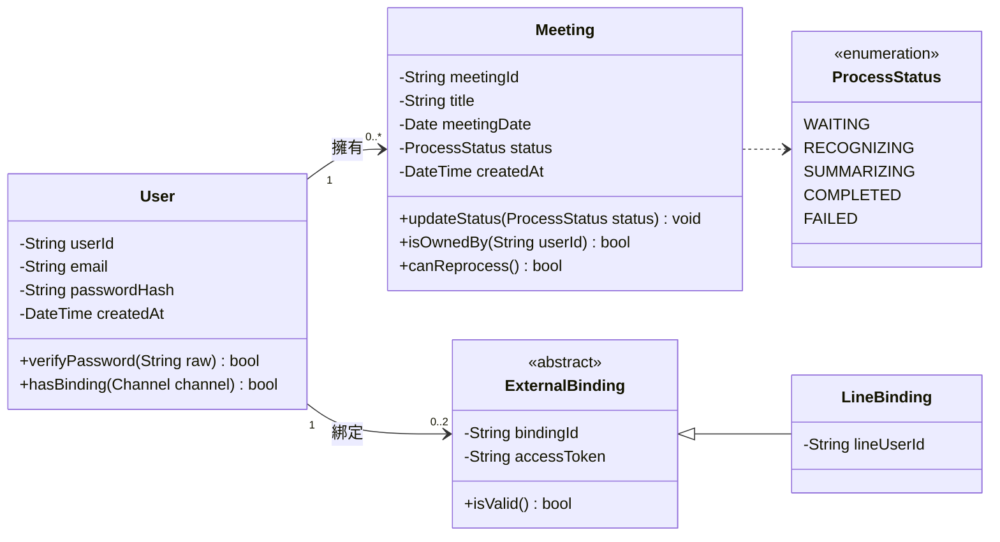

# project

```mermaid
classDiagram
    direction LR

    class User {
        -String userId
        -String email
        -String passwordHash
        -DateTime createdAt
        +verifyPassword(String raw) bool
        +hasBinding(Channel channel) bool
    }

    class Meeting {
        -String meetingId
        -String title
        -Date meetingDate
        -ProcessStatus status
        -DateTime createdAt
        +updateStatus(ProcessStatus status) void
        +isOwnedBy(String userId) bool
        +canReprocess() bool
    }

    class ProcessStatus {
        <<enumeration>>
        WAITING
        RECOGNIZING
        SUMMARIZING
        COMPLETED
        FAILED
    }

    class ExternalBinding {
        <<abstract>>
        -String bindingId
        -String accessToken
        +isValid() bool
    }

    class LineBinding {
        -String lineUserId
    }

    %% 關聯線條與多重性 (Multiplicity)
    User "1" --> "0..*" Meeting : 擁有
    User "1" --> "0..2" ExternalBinding : 綁定
    Meeting ..> ProcessStatus
    ExternalBinding <|-- LineBinding
```
