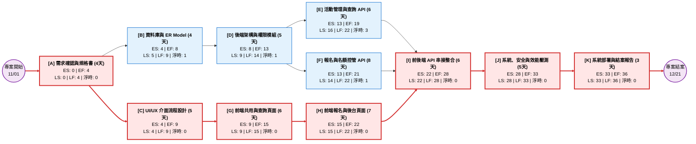

```mermaid
flowchart LR
    %% 定義樣式：要徑為紅色，一般路徑為藍色
    classDef critical fill:#ffe6e6,stroke:#d32f2f,stroke-width:3px,color:#000
    classDef normal fill:#e3f2fd,stroke:#1976d2,stroke-width:1.5px,color:#000
    classDef milestone fill:#f3e5f5,stroke:#7b1fa2,stroke-width:2px,color:#000

    START((專案開始<br/>11/01)):::milestone
    END((專案結案<br/>12/21)):::milestone

    A["<b>[A] 需求確認與規格書 (4天)</b><br/>ES: 0 | EF: 4<br/>LS: 0 | LF: 4 | 浮時: 0"]:::critical
    B["<b>[B] 資料庫與 ER Model (4天)</b><br/>ES: 4 | EF: 8<br/>LS: 5 | LF: 9 | 浮時: 1"]:::normal
    C["<b>[C] UI/UX 介面流程設計 (5天)</b><br/>ES: 4 | EF: 9<br/>LS: 4 | LF: 9 | 浮時: 0"]:::critical
    D["<b>[D] 後端架構與權限模組 (5天)</b><br/>ES: 8 | EF: 13<br/>LS: 9 | LF: 14 | 浮時: 1"]:::normal
    E["<b>[E] 活動管理與查詢 API (6天)</b><br/>ES: 13 | EF: 19<br/>LS: 16 | LF: 22 | 浮時: 3"]:::normal
    F["<b>[F] 報名與名額控管 API (8天)</b><br/>ES: 13 | EF: 21<br/>LS: 14 | LF: 22 | 浮時: 1"]:::normal
    G["<b>[G] 前端共用與查詢頁面 (6天)</b><br/>ES: 9 | EF: 15<br/>LS: 9 | LF: 15 | 浮時: 0"]:::critical
    H["<b>[H] 前端報名與後台頁面 (7天)</b><br/>ES: 15 | EF: 22<br/>LS: 15 | LF: 22 | 浮時: 0"]:::critical
    I["<b>[I] 前後端 API 串接整合 (6天)</b><br/>ES: 22 | EF: 28<br/>LS: 22 | LF: 28 | 浮時: 0"]:::critical
    J["<b>[J] 系統、安全與效能壓測 (5天)</b><br/>ES: 28 | EF: 33<br/>LS: 28 | LF: 33 | 浮時: 0"]:::critical
    K["<b>[K] 系統部署與結案報告 (3天)</b><br/>ES: 33 | EF: 36<br/>LS: 33 | LF: 36 | 浮時: 0"]:::critical

    %% 任務相依連線
    START --> A
    A --> B
    A --> C
    B --> D
    D --> E
    D --> F
    C --> G
    G --> H
    E --> I
    F --> I
    H --> I
    I --> J
    J --> K
    K --> END

    %% 將要徑連線標示為紅色粗線 (依連線順序索引 0-based)
    linkStyle 0,2,6,7,10,11,12,13 stroke:#d32f2f,stroke-width:3px
```

```mermaid
gantt
    title 系學會活動報名與名額管理系統 - 專案開發甘特圖
    dateFormat YYYY-MM-DD
    axisFormat %m/%d

    section 專案里程碑
    專案啟動 (Kick-off)           :milestone, m1, 2026-11-01, 0d
    系統正式驗收與結案            :milestone, m2, 2026-12-21, 0d

    section 1. 規劃與設計
    [A] 需求確認與系統規格書      :crit, a, 2026-11-01, 4d
    [B] 資料庫與 ER Model 設計    :b, after a, 4d
    [C] UI/UX 介面與流程設計      :crit, c, after a, 5d

    section 2. 後端開發
    [D] 後端架構與權限驗證模組    :d, after b, 5d
    [E] 活動管理與查詢 API        :e, after d, 6d
    [F] 報名、名額與取消 API      :f, after d, 8d

    section 3. 前端開發
    [G] 前端共用版型與查詢頁面    :crit, g, after c, 6d
    [H] 前端報名與管理後台頁面    :crit, h, after g, 7d

    section 4. 整合、測試與部署
    期中緩衝與進度檢核點          :milestone, m_mid, 2026-11-28, 0d
    [I] 前後端 API 串接整合       :crit, i, 2026-11-29, 7d
    [J] 系統、安全與效能壓測      :crit, j, after i, 8d
    [K] 系統部署上線與結案報告    :crit, k, after j, 7d
```
